# Parking Management System API
## Sobre
This project consists of creating a REST API for managing check-ins/check-outs and parking spaces in a parking lot.

### Technologies Used
* Java: A high-level, object-oriented programming language widely used for building server-side applications, web services, and Android applications.

* Spring Boot: A framework that simplifies the development of Java applications by providing built-in features for dependency injection, configuration, and microservices support.

* Spring Doc: A library that integrates Swagger for automatic generation of API documentation in Spring Boot applications, making it easier to interact with RESTful services.

* Lombok: A Java library that reduces boilerplate code by generating common methods like getters, setters, constructors, and more through annotations.

* ModelMapper: A Java library that simplifies object mapping by automating the conversion between DTOs and entity models, particularly in layered architectures.

* h2 database: A lightweight, in-memory database often used for development and testing purposes in Java applications.

* JUnit: A widely-used testing framework for Java applications, enabling developers to write unit tests to validate the functionality of their code.

* JPA: The Java Persistence API, a specification that provides object-relational mapping (ORM) to manage relational data in Java applications.

* MySQL: A popular open-source relational database management system used for storing and managing data in web applications.

* MySQL Workbench: A visual tool for database architects and developers that provides SQL development, data modeling, and comprehensive administration features for MySQL databases.

* Flyway: A version control tool for databases that enables developers to track and apply schema migrations in a consistent manner.

* Postman: A tool used for API testing and development, enabling users to send HTTP requests, inspect responses, and automate API tests.

**IDE: IntelliJ IDEA Community Edition 2024.2**

## Requirements
To use the project on your machine, the following tools must be installed and configured beforehand:

- Java Development Kit (JDK) 11 ou superior
- Apache Maven
- MySQL 8.0.34
- MySQL Workbench 8.0
- Postman

## Installation guide
Follow the steps below to download, configure, and run the project in your environment:
1. **Clone the repository**
```bash
git clone https://github.com/ABeatrizSC/parking-management-system-api.git
 ```
```bash
cd parking-management-system-api
 ```
Navigate to the project directory

2. **Install dependenciess**

 ```bash
mvn clean install
 ```

2. **Run the application**

Start the Spring Boot application:
 ```bash
mvn spring-boot:run
 ```

## API Endpoints

### Resume
| CATEGORY       | HTTP METHOD | ENDPOINT                                  | ACTION                                  |
|----------------|-------------|-------------------------------------------|-----------------------------------------|
| Vehicles       | DELETE      | /api/vehicles/{id}                        | Deletes a given vehicle by ID           |
| Vehicles       | GET         | /api/vehicles                             | Returns all vehicles                   |
| Vehicles       | GET         | /api/vehicles/{id}                        | Returns a given vehicle by ID          |
| Vehicles       | GET         | /api/vehicles/licensePlate={licensePlate} | Returns a given vehicle by plate       |
| Vehicles       | PATCH       | /api/vehicles/{id}                        | Updates a given vehicle by ID          |
| Vehicles       | POST        | /api/vehicles                             | Creates a new vehicle                 |
| Tickets        | GET         | /api/tickets                              | Get all tickets                        |
| Tickets        | GET         | /api/tickets/{id}                         | Get ticket by ID                       |
| Tickets        | POST        | /api/tickets                              | Check-in                              |
| Tickets        | POST        | /api/tickets/{id}/checkout                | Check-out                             |
| Parking Spaces | DELETE      | /api/parkingspaces/{id}                   | Deletes a given parking space by ID     |
| Parking Spaces | GET         | /api/parkingspaces                        | Returns all parking spaces              |
| Parking Spaces | GET         | /api/parkingspaces/available              | Returns all available parking spaces    |
| Parking Spaces | GET         | /api/parkingspaces/{id}                   | Returns a given parking space by ID     |
| Parking Spaces | GET         | /api/parkingspaces/number/{number}        | Returns a given parking space by number |
| Parking Spaces | GET         | /api/parkingspaces/slotType={slotType}    | Returns parking spaces by slot type     |
| Parking Spaces | POST        | /api/parkingspaces                        | Creates a new parking space            |
| Parking Spaces | PUT         | /api/parkingspaces/{id}                   | Updates a given parking space by ID     |

### Using Postman
#### Vehicle - Create a new vehicle
* HTTP Method: POST
````text
curl --location 'http://localhost:8080/api/vehicles' \
--header 'Content-Type: application/json' \
--data '    {
        "licensePlate": "TEST567",
        "category": "MONTHLY_PAYER",
        "accessType": "MOTORCYCLE"
    }'
````
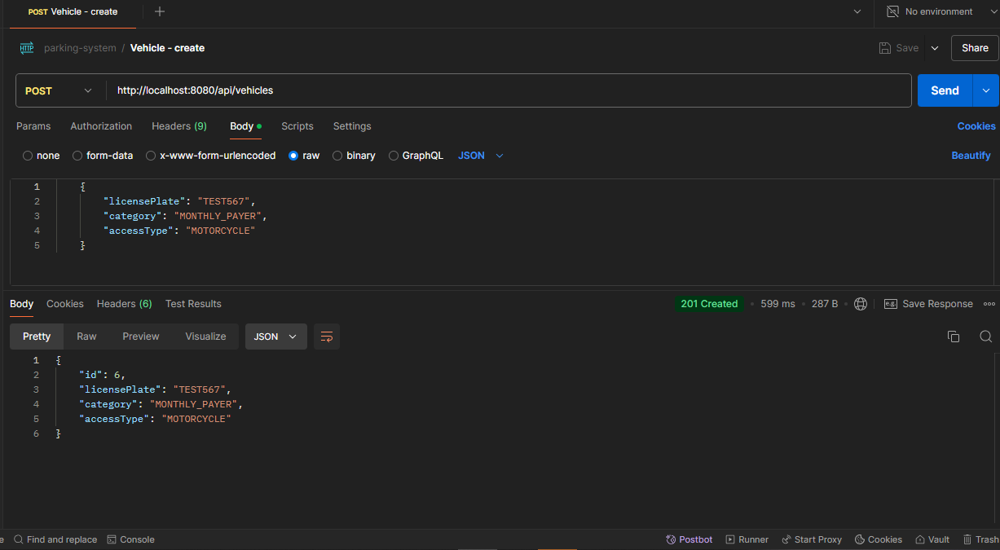

#### Vehicle - Get all vehicles
* HTTP Method: GET
````text
curl --location 'http://localhost:8080/api/vehicles'
````
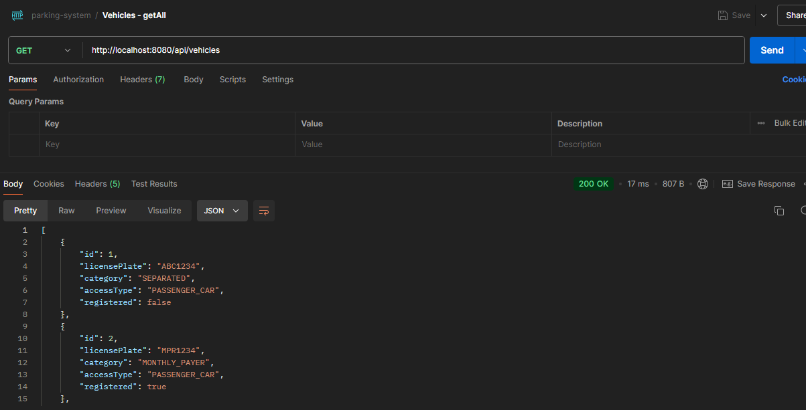

#### Vehicle - Get a vehicle by id
* HTTP Method: GET
````text
curl --location 'http://localhost:8080/api/vehicles/6'
````
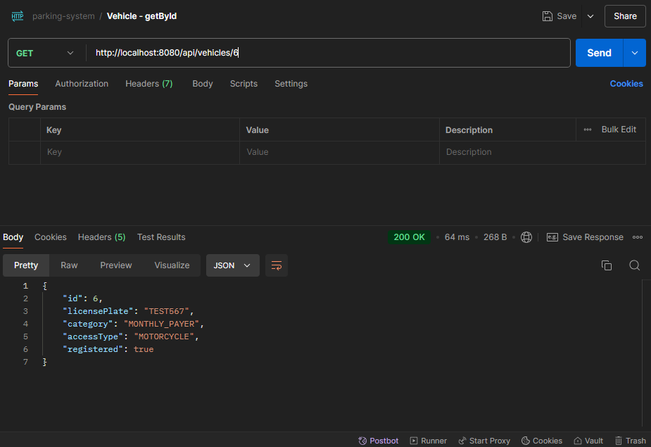

#### Vehicle - Get a vehicle by license plate
* HTTP Method: GET
````text
curl --location 'http://localhost:8080/api/vehicles/licensePlate=TEST567'
````
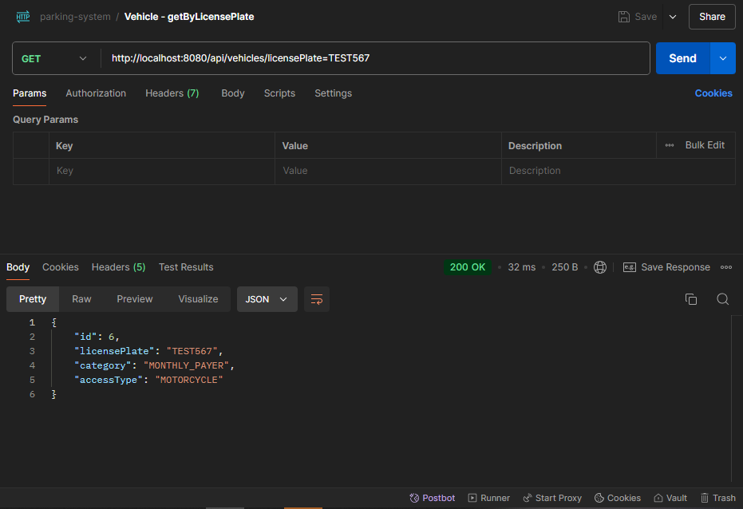

#### Vehicle - Update an existing vehicle by id
* HTTP Method: PATCH
````text
curl --location --request PATCH 'http://localhost:8080/api/vehicles/6' \
--header 'Content-Type: application/json' \
--data '    {
        "licensePlate": "NEW1234",
        "category": "MONTHLY_PAYER",
        "accessType": "MOTORCYCLE"
    }'
````
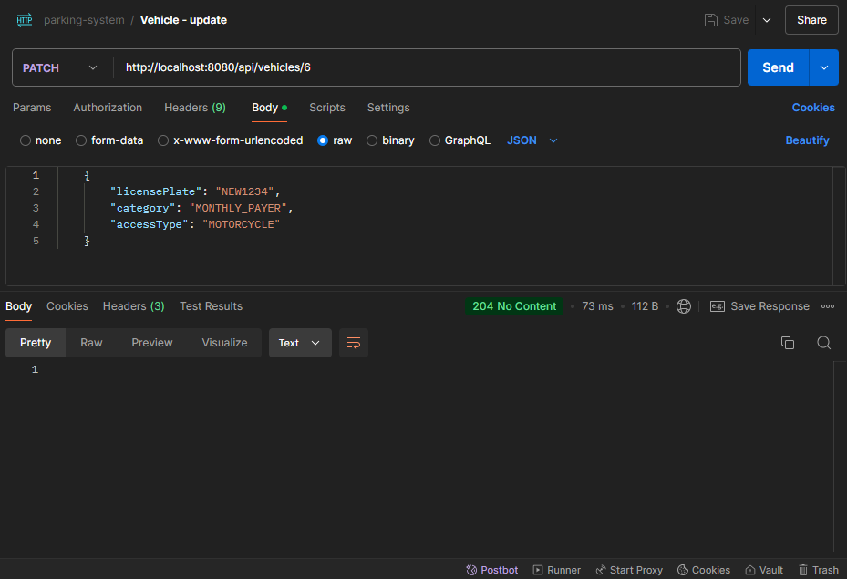

#### Vehicle - Delete an existing vehicle by id
* HTTP Method: DELETE
````text
curl --location --request DELETE 'http://localhost:8080/api/vehicles/6'
````
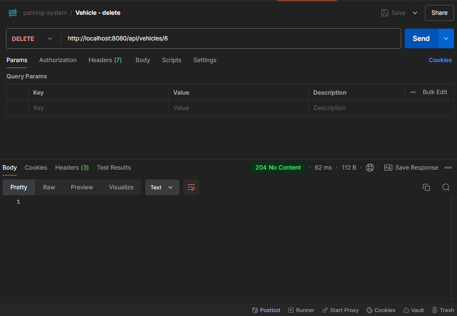

### Ticket - Get All Tickets
* HTTP Method: GET
````text
curl --location 'http://localhost:8080/api/tickets'
````
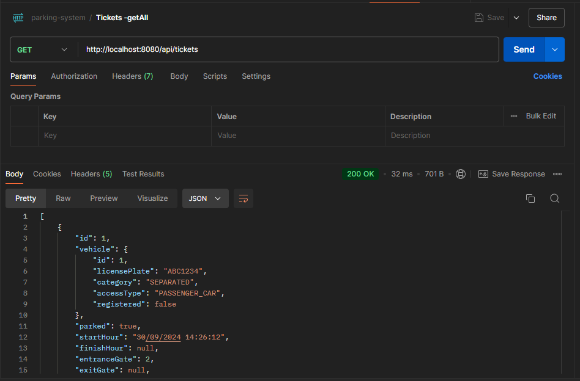

### Ticket - Generate a new ticket
* HTTP Method: POST
````text
curl --location 'http://localhost:8080/api/tickets' \
--header 'Content-Type: application/json' \
--data '{
  "licensePlate": "MPR1234",
  "accessType": "MONTHLY_PAYER"
}'
````
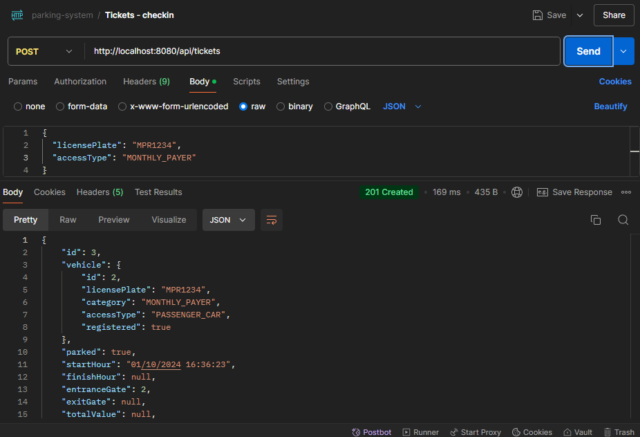

### Ticket - Get a ticket by id
* HTTP Method: GET
````text
curl --location 'http://localhost:8080/api/tickets/3'
````
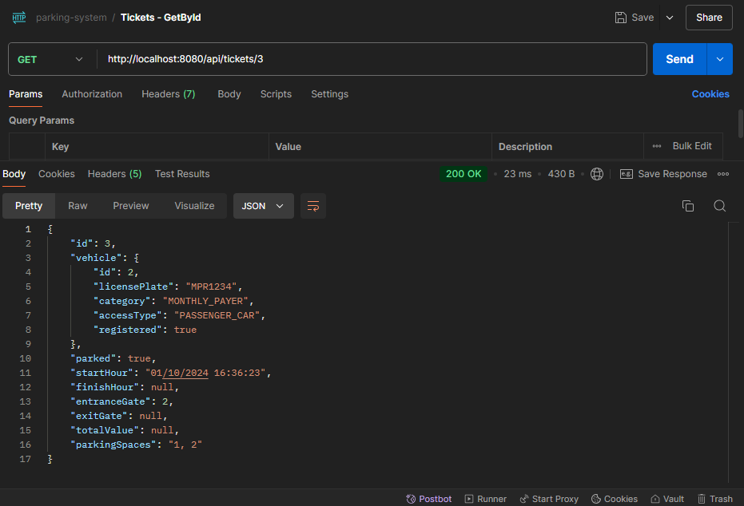

### Ticket - Checkout a ticket
* HTTP Method: POST
````text
curl --location --request POST 'http://localhost:8080/api/tickets/3/checkout'
````
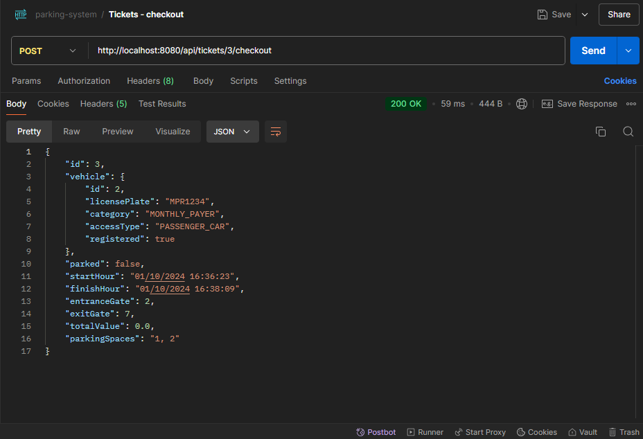

### Parking Space - Get All parking spaces
* HTTP Method: GET
````text
curl --location 'http://localhost:8080/api/parkingspaces'
````
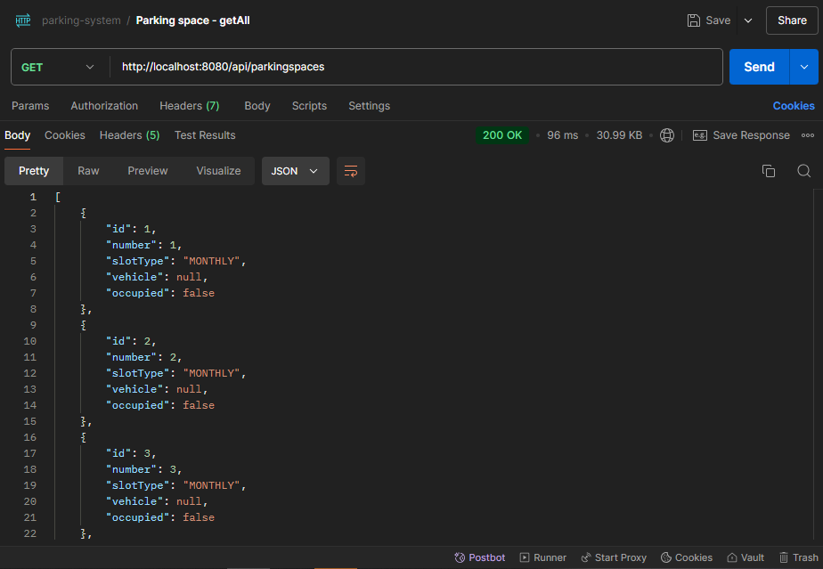

### Parking Space - Create a new parking space
* HTTP Method: POST
````text
curl --location 'http://localhost:8080/api/parkingspaces' \
--header 'Content-Type: application/json' \
--data '{
  "slotType": "CASUAL",
  "occupied": false
}'
````
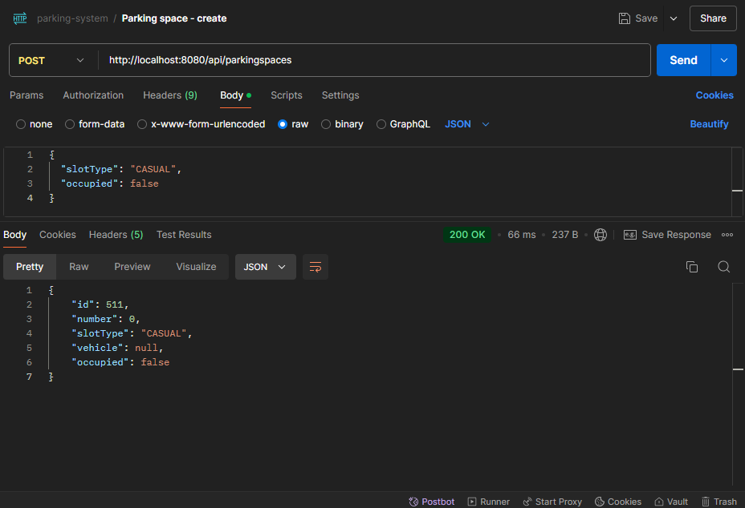

### Parking Space - Get a parking space by id
* HTTP Method: GET
````text
curl --location 'http://localhost:8080/api/parkingspaces/1'
````


### Parking Space - Get a parking space by number
* HTTP Method: GET
````text
curl --location 'http://localhost:8080/api/parkingspaces/number/1'
````

### Parking Space - Get a parking space by slot type
* HTTP Method: GET
````text
curl --location 'http://localhost:8080/api/parkingspaces/slotType=CASUAL'
````
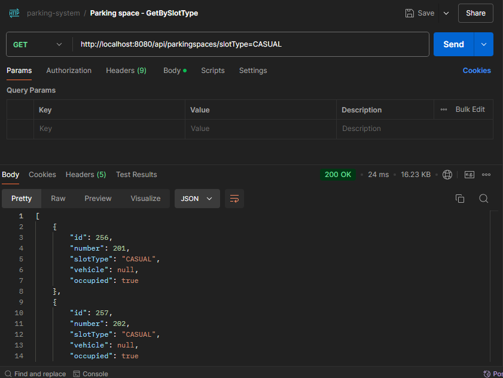


### Parking Space - Get all parking spaces available
* HTTP Method: GET
````text
curl --location 'http://localhost:8080/api/parkingspaces/available'
````
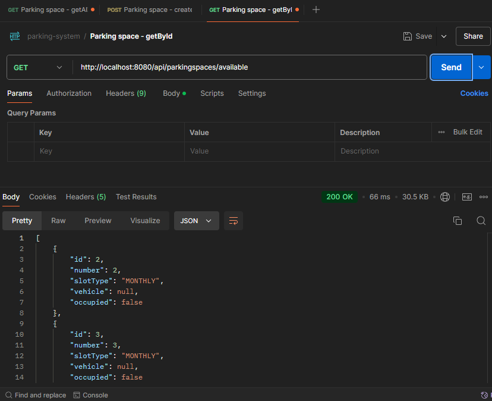

### Parking Space - Update an existing parking space 
* HTTP Method: PUT
````text
````


### Parking Space - Delete an existing parking space by id
* HTTP Method: DELETE
````text
curl --location --request DELETE 'http://localhost:8080/api/vehicles/1'
````
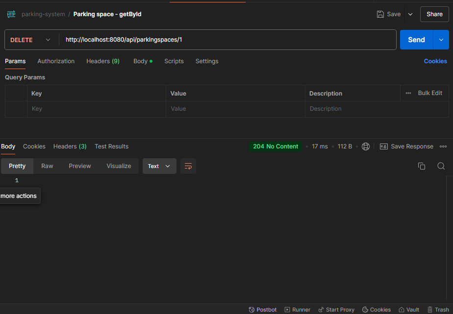

## Authors
* [Allan Denner](https://github.com/allandmg)
* [Ana Carmoni](https://github.com/ABeatrizSC)
* [Pedro Cavalcante](https://github.com/daysources)
* [Juliana Girotto](https://github.com/jjgirotto)
* [Mateus Lacerda](https://github.com/MateusLacerdaDeSouza)
